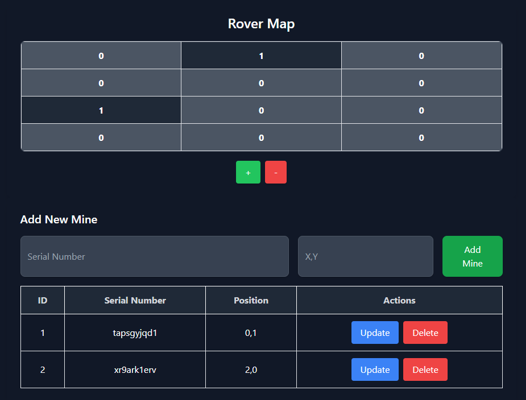
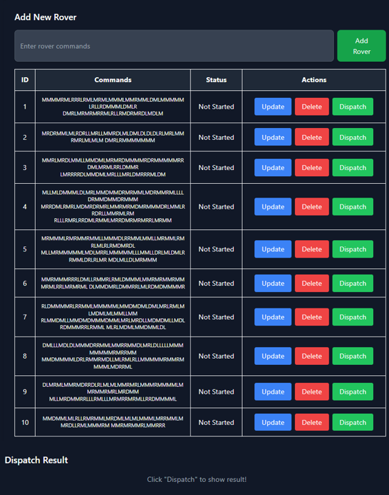
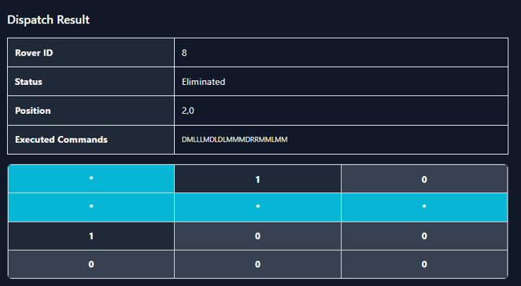
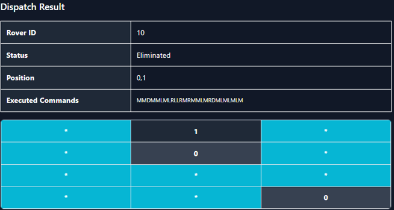

# 🛰️ 2D Rover Simulator


---

## 📑 Table of Contents


- [📜 Project Description](#-project-description)
- [🧭 Commands](#-commands)
- [💣 Mine Disarmament](#-mine-disarmament)
- [🚀 Getting Started (w/ FastAPI)](#-getting-started-fastapi)
  - [🔧 Backend Setup (FastAPI Server)](#-backend-setup-fastapi-server)
  - [🌐 Frontend Setup (React)](#-frontend-setup-react)
- [🚀 Getting Started (w/ CLI)](#-getting-started-cli)  
- [📸 Preview / Result](#-preview--result)

---

## 📜 Project Description

This project simulates a 2D rover navigating a terrain filled with hidden mines. The rover interprets movement commands, avoids obstacles, and disarms mines using a proof-of-work-based hashing mechanism.

---

## 🧭 Commands

- `L` — Turn the rover left
- `R` — Turn the rover right
- `M` — Move forward one step in the current direction
- `D` — Dig and attempt to disarm a mine at the current location

---

## 💣 Mine Disarmament

Each mine is associated with a **unique serial number**. To disarm it, the rover:

1. Generates a random **PIN** and prepends it to the serial number.
2. Hashes the result using **SHA-256**.
3. Checks if the hash starts with **six leading zeros (`000000`)**.
4. Repeats the process until successful.

This mimics a basic **proof-of-work** algorithm similar to blockchain mining.

---

## 🚀 Getting Started (w/ FastAPI)

### 🔧 Backend Setup (FastAPI Server)

```bash
# Install FastAPI and Uvicorn
pip install fastapi==0.115.1 uvicorn==0.34.0

# Run the FastAPI server
uvicorn Fastapi_Rover_Server:app --reload

# API Root: http://127.0.0.1:8000
# Swagger UI: http://127.0.0.1:8000/docs
```
### 🌐 Frontend Setup (React)

```bash
# Navigate to the frontend directory
cd frontend

# Install all dependencies
npm install

# Start the development server
npm run dev
```
🚀 Getting Started (w/ CLI)


### 📸 Preview / Result

<p align="center">
  
  <br/>
  <em>Figure 1: Initial minefield terrain with mine locations.</em>
</p>

<p align="center">
  
  <br/>
  <em>Figure 2: Rover command input interface and issued commands.</em>
</p>

<p align="center">
  
  <br/>
  <em>Figure 3: Navigation path and execution results for Rover #8.</em>
</p>

<p align="center">
  
  <br/>
  <em>Figure 4:Navigation path and execution results for Rover #10.</em>
</p>


